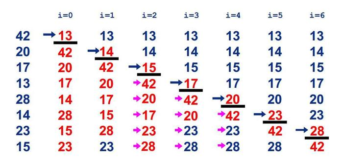
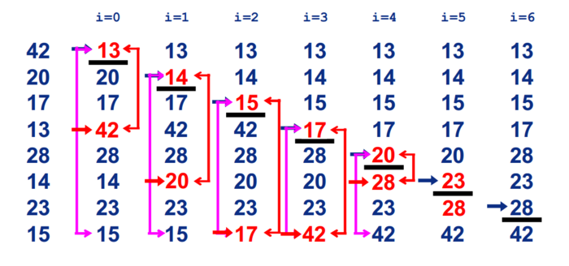

#### 冒泡排序

基本思想：两个数比较大小，较大的数下沉，较小的数冒起来。
过程：比较相邻的两个数据，如果第二个数小，就交换位置。
从后向前两两比较，一直到比较最前两个数据。最终最小数被交换到起始的位置，这样第一个最小数的位置就排好了。
继续重复上述过程，依次将第2.3...n-1个最小数排好位置。

``` java
public static void sort(int[] arr) {
    int temp;//临时变量
    for (int i = 0; i < arr.length - 1; i++) {//表示趟数，一共arr.length-1次。
        for (int j = arr.length - 1; j > i; j--) {
            if (arr[j] < arr[j - 1]) {
                temp = arr[j];
                arr[j] = arr[j - 1];
                arr[j - 1] = temp;
            }
        }
    }
}
```
#### 选择排序
基本思想：
在长度为N的无序数组中，第一次遍历n-1个数，找到最小的数值与第一个元素交换；
第二次遍历n-2个数，找到最小的数值与第二个元素交换；
第n-1次遍历，找到最小的数值与第n-1个元素交换，排序完成。

过程：

``` java
public static void sort(int array[]) {
    for (int i = 0; i < array.length - 1; i++) {
        int minIndex = i;
        for (int j = i + 1; j < array.length; j++) {
            if (array[j] < array[minIndex]) {
                minIndex = j;
            }
        }
        if (minIndex != i) {
            int temp = array[i];
            array[i] = array[minIndex];
            array[minIndex] = temp;
        }
    }
}
```