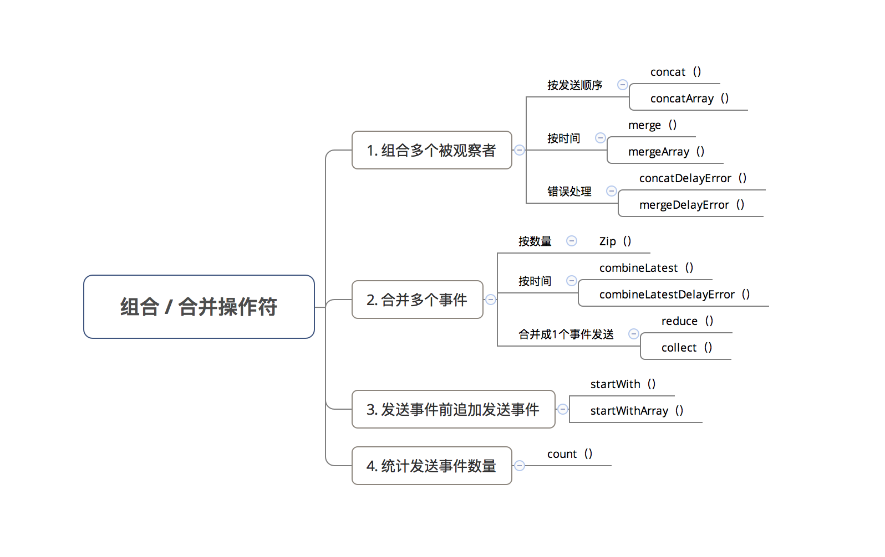
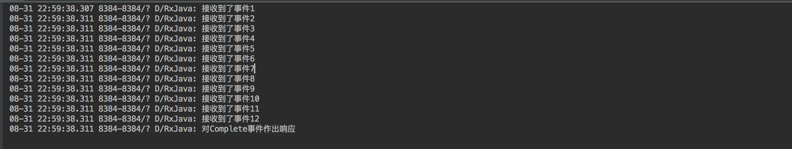
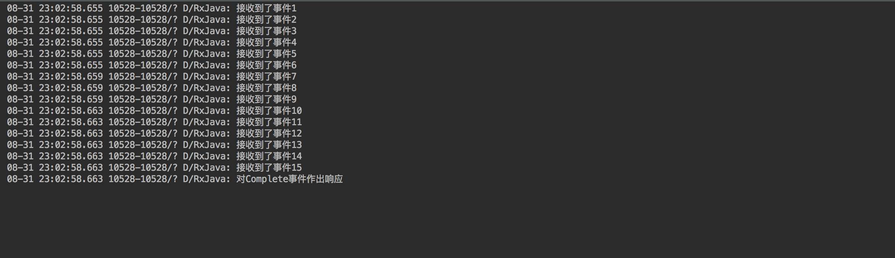
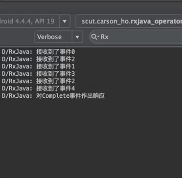
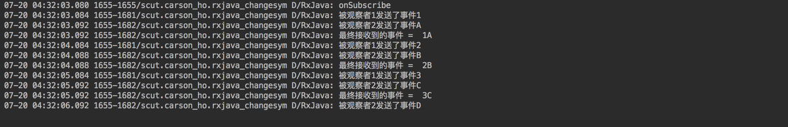

### 组合多个被观察者

**concat( ) / concatArray( )**

作用
组合多个被观察者一起发送数据，合并后 按发送顺序串行执行

> 二者区别：组合被观察者的数量，即concat( )组合被观察者数量≤4个，而concatArray( )则可>4个

``` java
Observable.concat(Observable.just(1, 2, 3),
        Observable.just(4, 5, 6),
        Observable.just(7, 8, 9),
        Observable.just(10, 11, 12))
        .subscribe(new Observer<Integer>() {
            @Override
            public void onSubscribe(Disposable d) {
            }
            @Override
            public void onNext(Integer value) {
                Log.d(TAG, "接收到了事件" + value);
            }
            @Override
            public void onError(Throwable e) {
                Log.d(TAG, "对Error事件作出响应");
            }
            @Override
            public void onComplete() {
                Log.d(TAG, "对Complete事件作出响应");
            }
        });
// concatArray（）：组合多个被观察者一起发送数据（可>4个）
// 注：串行执行
Observable.concatArray(Observable.just(1, 2, 3),
        Observable.just(4, 5, 6),
        Observable.just(7, 8, 9),
        Observable.just(10, 11, 12),
        Observable.just(13, 14, 15))
        .subscribe(new Observer<Integer>() {
            @Override
            public void onSubscribe(Disposable d) {
            }
            @Override
            public void onNext(Integer value) {
                Log.d(TAG, "接收到了事件" + value);
            }
            @Override
            public void onError(Throwable e) {
                Log.d(TAG, "对Error事件作出响应");
            }
            @Override
            public void onComplete() {
                Log.d(TAG, "对Complete事件作出响应");
            }
        });
```



**merge( ) / mergeArray( )**

作用
组合多个被观察者一起发送数据，合并后 按时间线并行执行

> 二者区别：二者区别：组合被观察者的数量，即merge( )组合被观察者数量≤4个，而mergeArray( )则可>4个
> 区别上述concat( )操作符：同样是组合多个被观察者一起发送数据，但concat( )操作符合并后是按发送顺序串行执行

``` java
// merge（）：组合多个被观察者（＜4个）一起发送数据
// 注：合并后按照时间线并行执行
Observable.merge(
        Observable.intervalRange(0, 3, 1, 1, TimeUnit.SECONDS), // 从0开始发送、共发送3个数据、第1次事件延迟发送时间 = 1s、间隔时间 = 1s
        Observable.intervalRange(2, 3, 1, 1, TimeUnit.SECONDS)) // 从2开始发送、共发送3个数据、第1次事件延迟发送时间 = 1s、间隔时间 = 1s
        .subscribe(new Observer<Long>() {
            @Override
            public void onSubscribe(Disposable d) {
            }
            @Override
            public void onNext(Long value) {
                Log.d(TAG, "接收到了事件" + value);
            }
            @Override
            public void onError(Throwable e) {
                Log.d(TAG, "对Error事件作出响应");
            }
            @Override
            public void onComplete() {
                Log.d(TAG, "对Complete事件作出响应");
            }
        });
// mergeArray（） = 组合4个以上的被观察者一起发送数据，此处不作过多演示，类似concatArray（）
```


**concatDelayError( ) / mergeDelayError( )**

没啥用

### 合并多个事件

**Zip( )**

作用
合并 多个被观察者（Observable）发送的事件，生成一个新的事件序列（即组合过后的事件序列），并最终发送

> 事件组合方式 = 严格按照原先事件序列 进行对位合并
> 最终合并的事件数量 = 多个被观察者（Observable）中数量最少的数量

``` java
        //创建第1个被观察者
        Observable<Integer> observable1 = Observable.create(new ObservableOnSubscribe<Integer>() {
            @Override
            public void subscribe(ObservableEmitter<Integer> emitter) throws Exception {
                Log.d(TAG, "被观察者1发送了事件1");
                emitter.onNext(1);
                // 为了方便展示效果，所以在发送事件后加入1s的延迟
                Thread.sleep(1000);

                Log.d(TAG, "被观察者1发送了事件2");
                emitter.onNext(2);
                Thread.sleep(1000);

                Log.d(TAG, "被观察者1发送了事件3");
                emitter.onNext(3);
                Thread.sleep(1000);

                emitter.onComplete();
            }
        }).subscribeOn(Schedulers.io()); // 设置被观察者1在工作线程1中工作

        //创建第2个被观察者
        Observable<String> observable2 = Observable.create(new ObservableOnSubscribe<String>() {
            @Override
            public void subscribe(ObservableEmitter<String> emitter) throws Exception {
                Log.d(TAG, "被观察者2发送了事件A");
                emitter.onNext("A");
                Thread.sleep(1000);

                Log.d(TAG, "被观察者2发送了事件B");
                emitter.onNext("B");
                Thread.sleep(1000);

                Log.d(TAG, "被观察者2发送了事件C");
                emitter.onNext("C");
                Thread.sleep(1000);

                Log.d(TAG, "被观察者2发送了事件D");
                emitter.onNext("D");
                Thread.sleep(1000);

                emitter.onComplete();
            }
        }).subscribeOn(Schedulers.newThread());// 设置被观察者2在工作线程2中工作
        // 假设不作线程控制，则该两个被观察者会在同一个线程中工作，即发送事件存在先后顺序，而不是同时发送

        //使用zip变换操作符进行事件合并
        // 注：创建BiFunction对象传入的第3个参数 = 合并后数据的数据类型
        Observable.zip(observable1, observable2, new BiFunction<Integer, String, String>() {
            @Override
            public String apply(Integer integer, String string) throws Exception {
                return integer + string;
            }
        }).subscribe(new Observer<String>() {
            @Override
            public void onSubscribe(Disposable d) {
                Log.d(TAG, "onSubscribe");
            }

            @Override
            public void onNext(String value) {
                Log.d(TAG, "最终接收到的事件 =  " + value);
            }

            @Override
            public void onError(Throwable e) {
                Log.d(TAG, "onError");
            }

            @Override
            public void onComplete() {
                Log.d(TAG, "onComplete");
            }
        });
```


**combineLatest( )**

**combineLatestDelayError( )**

**reduce( )**

**collect( )**

没啥用

### 发送事件前追加发送事件

**startWith( ) / startWithArray( )**

没啥用

### 统计发送事件数量

没啥用