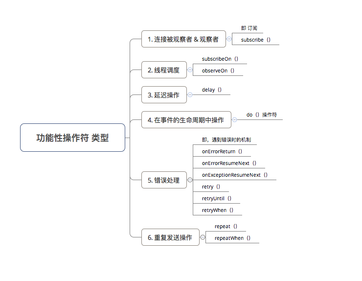
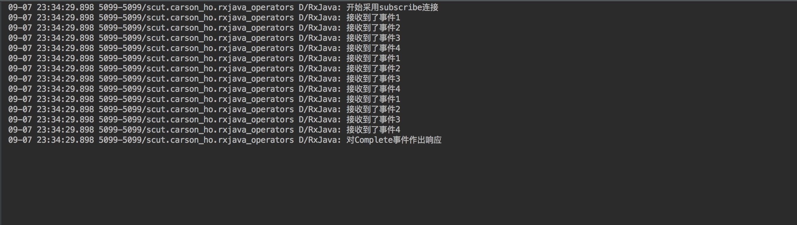

### 连接被观察者 & 观察者

**subscribe( )**

作用
订阅，即连接观察者 & 被观察者

简单，略过

### 线程调度

subscribeOn( )指定 被观察者 (Observable) 的工作线程类型
observeOn( )指定 被观察者观察者 (Observer) 的工作线程类型

类型        | 含义    |  应用场景 
---|---|---
Schedulers.immediate()        | 当前线程 = 不指定线程     |   默认
AndroidSchedulers.mainThread()       | Android主线程      |   	操作UI
Schedulers.newThread()        | 常规新线程      |   耗时等操作
Schedulers.io()       | io操作线程      |   网络请求、读写文件等io密集型操作
Schedulers.computation()        | CPU计算操作线程      |   大量计算操作

### 延迟操作

**delay( )**

作用
使得被观察者延迟一段时间再发送事件

``` java 
Observable.just(1, 2, 3)
        .delay(3, TimeUnit.SECONDS) // 延迟3s再发送
        .subscribe(new Observer<Integer>() {
            @Override
            public void onSubscribe(Disposable d) {
            }
            @Override
            public void onNext(Integer value) {
                Log.d(TAG, "接收到了事件" + value);
            }
            @Override
            public void onError(Throwable e) {
                Log.d(TAG, "对Error事件作出响应");
            }
            @Override
            public void onComplete() {
                Log.d(TAG, "对Complete事件作出响应");
            }
        });
```

### 在事件的生命周期中操作

**do( )**

没啥用

### 错误处理

**onErrorReturn( )**

**onErrorResumeNext( )**

**onExceptionResumeNext( )**

没啥用

**retry( )**

作用
重试，即当出现错误时，让被观察者（Observable）重新发射数据

> 接收到 onError（）时，重新订阅 & 发送事件
> Throwable 和 Exception都可拦截

``` java
Observable.create(new ObservableOnSubscribe<Integer>() {
    @Override
    public void subscribe(ObservableEmitter<Integer> e) throws Exception {
        e.onNext(1);
        e.onNext(2);
        e.onError(new Exception("发生错误了"));
        e.onNext(3);
    }
})
        .retry(3) // 设置重试次数 = 3次
        .subscribe(new Observer<Integer>() {
            @Override
            public void onSubscribe(Disposable d) {
            }
            @Override
            public void onNext(Integer value) {
                Log.d(TAG, "接收到了事件" + value);
            }
            @Override
            public void onError(Throwable e) {
                Log.d(TAG, "对Error事件作出响应");
            }
            @Override
            public void onComplete() {
                Log.d(TAG, "对Complete事件作出响应");
            }
        });
```

**retryUntil( )**

**retryWhen( )**

### 重复发送

**repeat( )**

作用
无条件地、重复发送 被观察者事件

> 具备重载方法，可设置重复创建次数

``` java 
Observable.just(1, 2, 3, 4)
        .repeat(3) // 重复创建次数 = 3次
        .subscribe(new Observer<Integer>() {
            @Override
            public void onSubscribe(Disposable d) {
                Log.d(TAG, "开始采用subscribe连接");
            }
            @Override
            public void onNext(Integer value) {
                Log.d(TAG, "接收到了事件" + value);
            }
            @Override
            public void onError(Throwable e) {
                Log.d(TAG, "对Error事件作出响应");
            }
            @Override
            public void onComplete() {
                Log.d(TAG, "对Complete事件作出响应");
            }
        });
```


**repeatWhen( )**

没啥用
