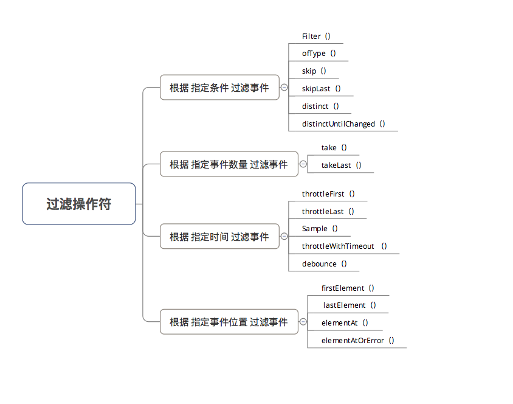
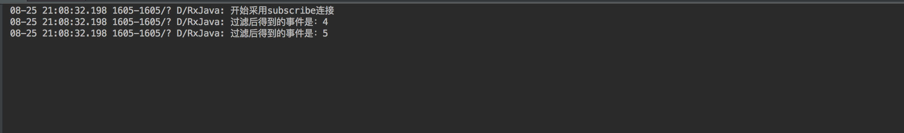
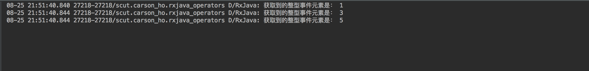
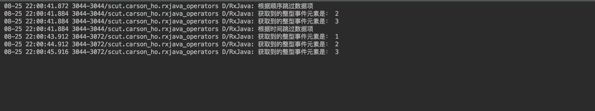
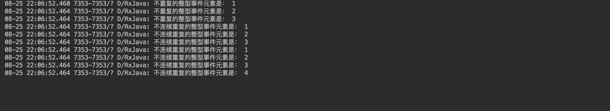
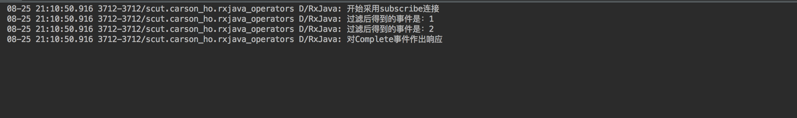
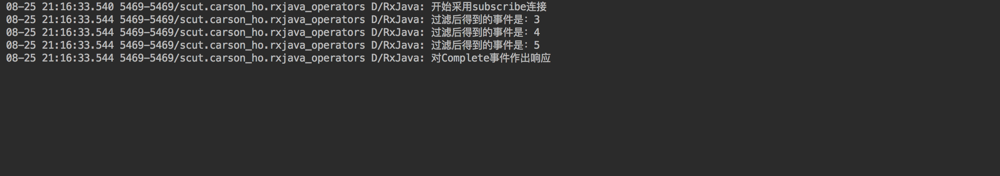
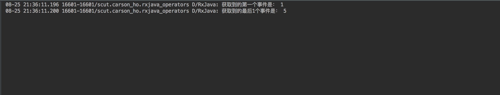
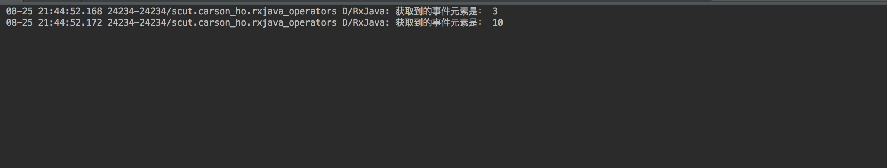
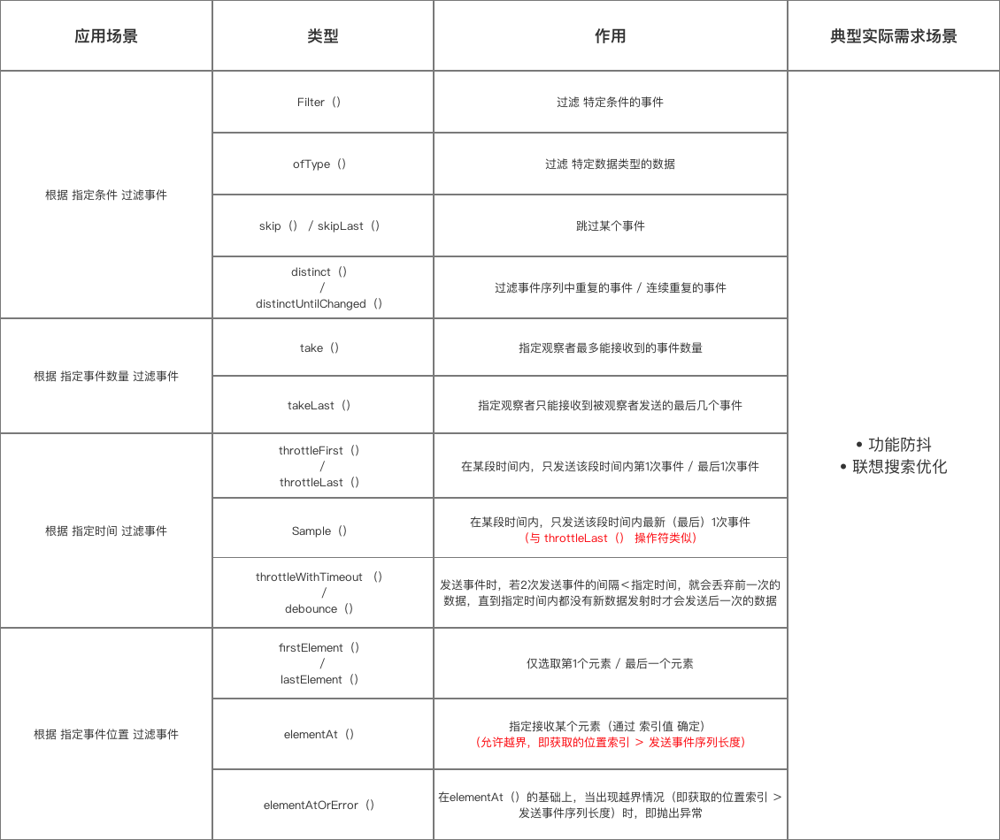

### 根据 指定条件 过滤事件

**Filter( )**

作用
过滤 特定条件的事件

``` java
Observable.create(new ObservableOnSubscribe<Integer>() {
    @Override
    public void subscribe(ObservableEmitter<Integer> emitter) throws Exception {
        // 1. 发送5个事件
        emitter.onNext(1);
        emitter.onNext(2);
        emitter.onNext(3);
        emitter.onNext(4);
        emitter.onNext(5);
    }
    // 2. 采用filter（）变换操作符
}).filter(new Predicate<Integer>() {
    // 根据test()的返回值 对被观察者发送的事件进行过滤 & 筛选
    // a. 返回true，则继续发送
    // b. 返回false，则不发送（即过滤）
    @Override
    public boolean test(Integer integer) throws Exception {
        return integer > 3;
        // 本例子 = 过滤了整数≤3的事件
    }
}).subscribe(new Observer<Integer>() {
    @Override
    public void onSubscribe(Disposable d) {
        Log.d(TAG, "开始采用subscribe连接");
    }
    @Override
    public void onNext(Integer value) {
        Log.d(TAG, "过滤后得到的事件是：" + value);
    }
    @Override
    public void onError(Throwable e) {
        Log.d(TAG, "对Error事件作出响应");
    }
    @Override
    public void onComplete() {
        Log.d(TAG, "对Complete事件作出响应");
    }
});
```


**ofType( )**

作用
过滤 特定数据类型的数据

``` java
Observable.just(1, "Carson", 3, "Ho", 5)
        .ofType(Integer.class) // 筛选出 整型数据
        .subscribe(new Consumer<Integer>() {
            @Override
            public void accept(Integer integer) throws Exception {
                Log.d(TAG, "获取到的整型事件元素是： " + integer);
            }
        });
```



**skip( ) / skipLast( )**

作用
跳过某个事件

``` java 
// 使用1：根据顺序跳过数据项
Observable.just(1, 2, 3, 4, 5)
        .skip(1) // 跳过正序的前1项
        .skipLast(2) // 跳过正序的后2项
        .subscribe(new Consumer<Integer>() {
            @Override
            public void accept(Integer integer) throws Exception {
                Log.d(TAG, "获取到的整型事件元素是： " + integer);
            }
        });
// 使用2：根据时间跳过数据项
// 发送事件特点：发送数据0-5，每隔1s发送一次，每次递增1；第1次发送延迟0s
Observable.intervalRange(0, 5, 0, 1, TimeUnit.SECONDS)
        .skip(1, TimeUnit.SECONDS) // 跳过第1s发送的数据
        .skipLast(1, TimeUnit.SECONDS) // 跳过最后1s发送的数据
        .subscribe(new Consumer<Long>() {
            @Override
            public void accept(Long along) throws Exception {
                Log.d(TAG, "获取到的整型事件元素是： " + along);
            }
        });
```



**distinct( ) / distinctUntilChanged( )**

作用
过滤事件序列中重复的事件 / 连续重复的事件

``` java
// 使用1：过滤事件序列中重复的事件
Observable.just(1, 2, 3, 1, 2)
        .distinct()
        .subscribe(new Consumer<Integer>() {
            @Override
            public void accept(Integer integer) throws Exception {
                Log.d(TAG, "不重复的整型事件元素是： " + integer);
            }
        });
// 使用2：过滤事件序列中 连续重复的事件
// 下面序列中，连续重复的事件 = 3、4
Observable.just(1, 2, 3, 1, 2, 3, 3, 4, 4)
        .distinctUntilChanged()
        .subscribe(new Consumer<Integer>() {
            @Override
            public void accept(Integer integer) throws Exception {
                Log.d(TAG, "不连续重复的整型事件元素是： " + integer);
            }
        });
```



### 根据 指定事件数量 过滤事件

**take( )**

作用
指定观察者最多能接收到的事件数量

``` java
        Observable.create(new ObservableOnSubscribe<Integer>() {
            @Override
            public void subscribe(ObservableEmitter<Integer> emitter) throws Exception {
                // 1. 发送5个事件
                emitter.onNext(1);
                emitter.onNext(2);
                emitter.onNext(3);
                emitter.onNext(4);
                emitter.onNext(5);
            }
            // 采用take（）变换操作符
            // 指定了观察者只能接收2个事件
        }).take(2)
                .subscribe(new Observer<Integer>() {

                    @Override
                    public void onSubscribe(Disposable d) {
                        Log.d(TAG, "开始采用subscribe连接");
                    }

                    @Override
                    public void onNext(Integer value) {
                        Log.d(TAG, "过滤后得到的事件是：" + value);
                    }

                    @Override
                    public void onError(Throwable e) {
                        Log.d(TAG, "对Error事件作出响应");
                    }

                    @Override
                    public void onComplete() {
                        Log.d(TAG, "对Complete事件作出响应");
                    }
                });
        // 实际上，可理解为：被观察者还是发送了5个事件，只是因为操作符的存在拦截了3个事件，最终观察者接收到的是2个事件
```



**takeLast( )**

作用
指定观察者只能接收到被观察者发送的最后几个事件

``` java
Observable.just(1, 2, 3, 4, 5)
        .takeLast(3) //指定观察者只能接受被观察者发送的3个事件
        .subscribe(new Observer<Integer>() {
            @Override
            public void onSubscribe(Disposable d) {
                Log.d(TAG, "开始采用subscribe连接");
            }
            @Override
            public void onNext(Integer value) {
                Log.d(TAG, "过滤后得到的事件是：" + value);
            }
            @Override
            public void onError(Throwable e) {
                Log.d(TAG, "对Error事件作出响应");
            }
            @Override
            public void onComplete() {
                Log.d(TAG, "对Complete事件作出响应");
            }
        });
```



### 根据 指定时间 过滤事件

**distinct( ) / distinctUntilChanged( )**

作用
在某段时间内，只发送该段时间内第1次事件 / 最后1次事件

**Sample( )**

作用
在某段时间内，只发送该段时间内最新（最后）1次事件

**distinct( ) / distinctUntilChanged( )**

作用
发送数据事件时，若2次发送事件的间隔＜指定时间，就会丢弃前一次的数据，直到指定时间内都没有新数据发射时才会发送后一次的数据

没啥用

### 根据 指定事件位置 过滤事件

**firstElement( ) / lastElement( )**

作用
仅选取第1个元素 / 最后一个元素

``` java
// 获取第1个元素
Observable.just(1, 2, 3, 4, 5)
        .firstElement()
        .subscribe(new Consumer<Integer>() {
            @Override
            public void accept(Integer integer) throws Exception {
                Log.d(TAG, "获取到的第一个事件是： " + integer);
            }
        });
// 获取最后1个元素
Observable.just(1, 2, 3, 4, 5)
        .lastElement()
        .subscribe(new Consumer<Integer>() {
            @Override
            public void accept(Integer integer) throws Exception {
                Log.d(TAG, "获取到的最后1个事件是： " + integer);
            }
        });
```



**elementAt( )**

作用
指定接收某个元素（通过 索引值 确定）

> 注：允许越界，即获取的位置索引 ＞ 发送事件序列长度

``` java
// 使用1：获取位置索引 = 2的 元素
// 位置索引从0开始
Observable.just(1, 2, 3, 4, 5)
        .elementAt(2)
        .subscribe(new Consumer<Integer>() {
            @Override
            public void accept(Integer integer) throws Exception {
                Log.d(TAG, "获取到的事件元素是： " + integer);
            }
        });
// 使用2：获取的位置索引 ＞ 发送事件序列长度时，设置默认参数
Observable.just(1, 2, 3, 4, 5)
        .elementAt(6, 10)
        .subscribe(new Consumer<Integer>() {
            @Override
            public void accept(Integer integer) throws Exception {
                Log.d(TAG, "获取到的事件元素是： " + integer);
            }
        });
```



**elementAtOrError( )**

作用
在elementAt（）的基础上，当出现越界情况（即获取的位置索引 > 发送事件序列长度）时，即抛出异常

没啥用

### 总结
