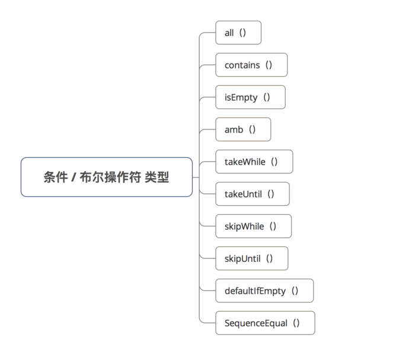

**all( )**

作用
判断发送的每项数据是否都满足 设置的函数条件

> 若满足，返回 true；否则，返回 false

``` java
Observable.just(1, 2, 3, 4, 5, 6)
        .all(new Predicate<Integer>() {
            @Override
            public boolean test(Integer integer) throws Exception {
                return (integer <= 10);
                // 该函数用于判断Observable发送的10个数据是否都满足integer<=10
            }
        }).subscribe(new Consumer<Boolean>() {
    @Override
    public void accept(Boolean aBoolean) throws Exception {
        Log.d(TAG, "result is " + aBoolean);
    }
});
```

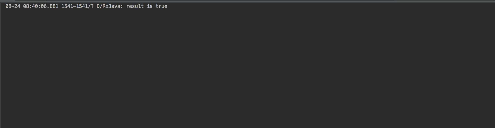

**takeWhile( )**

作用
判断发送的每项数据是否满足 设置函数条件

> 若发送的数据满足该条件，则发送该项数据；否则不发送

``` java
// 1. 每1s发送1个数据 = 从0开始，递增1，即0、1、2、3
Observable.interval(1, TimeUnit.SECONDS)
        // 2. 通过takeWhile传入一个判断条件
        .takeWhile(new Predicate<Long>() {
            @Override
            public boolean test(Long integer) throws Exception {
                return (integer < 3);
                // 当发送的数据满足<3时，才发送Observable的数据
            }
        }).subscribe(new Observer<Long>() {
    @Override
    public void onSubscribe(Disposable d) {
    }
    @Override
    public void onNext(Long value) {
        Log.d(TAG, "发送了事件 " + value);
    }
    @Override
    public void onError(Throwable e) {
    }
    @Override
    public void onComplete() {
    }
});
```

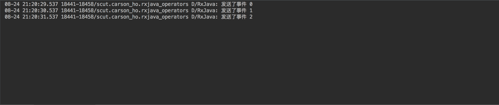

**skipWhile( )**

作用
判断发送的每项数据是否满足 设置函数条件

> 直到该判断条件 = false时，才开始发送Observable的数据

``` java
// 1. 每隔1s发送1个数据 = 从0开始，每次递增1
Observable.interval(1, TimeUnit.SECONDS)
        // 2. 通过skipWhile（）设置判断条件
        .skipWhile(new Predicate<Long>() {
            @Override
            public boolean test(Long aLong) throws Exception {
                return (aLong < 5);
                // 直到判断条件不成立 = false = 发射的数据≥5，才开始发送数据
            }
        }).subscribe(new Observer<Long>() {
    @Override
    public void onSubscribe(Disposable d) {
    }
    @Override
    public void onNext(Long value) {
        Log.d(TAG, "发送了事件 " + value);
    }
    @Override
    public void onError(Throwable e) {
    }
    @Override
    public void onComplete() {
    }
});
```

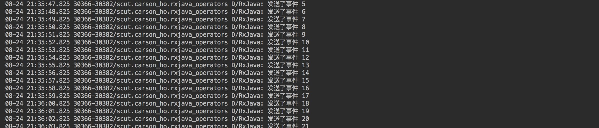

**takeUntil( )**

作用
执行到某个条件时，停止发送事件

``` java
// 1. 每1s发送1个数据 = 从0开始，递增1，即0、1、2、3
Observable.interval(1, TimeUnit.SECONDS)
        // 2. 通过takeUntil的Predicate传入判断条件
        .takeUntil(new Predicate<Long>() {
            @Override
            public boolean test(Long integer) throws Exception {
                return (integer > 3);
                // 返回true时，就停止发送事件
                // 当发送的数据满足>3时，就停止发送Observable的数据
            }
        }).subscribe(new Observer<Long>() {
    @Override
    public void onSubscribe(Disposable d) {
    }
    @Override
    public void onNext(Long value) {
        Log.d(TAG, "发送了事件 " + value);
    }
    @Override
    public void onError(Throwable e) {
    }
    @Override
    public void onComplete() {
    }
});
```

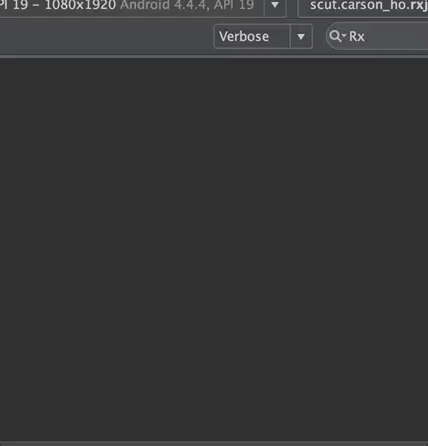

**skipUntil( )**

作用
等到 skipUntil()传入的Observable开始发送数据，（原始）第1个Observable的数据才开始发送数据

``` java
// （原始）第1个Observable：每隔1s发送1个数据 = 从0开始，每次递增1
Observable.interval(1, TimeUnit.SECONDS)
        // 第2个Observable：延迟5s后开始发送1个Long型数据
        .skipUntil(Observable.timer(5, TimeUnit.SECONDS))
        .subscribe(new Observer<Long>() {
            @Override
            public void onSubscribe(Disposable d) {
                Log.d(TAG, "开始采用subscribe连接");
            }
            @Override
            public void onNext(Long value) {
                Log.d(TAG, "接收到了事件" + value);
            }
            @Override
            public void onError(Throwable e) {
                Log.d(TAG, "对Error事件作出响应");
            }
            @Override
            public void onComplete() {
                Log.d(TAG, "对Complete事件作出响应");
            }
        });
```

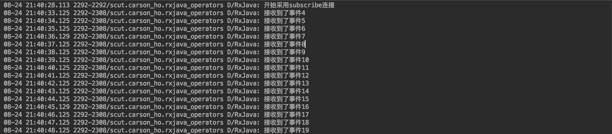

**SequenceEqual( )**

作用
判定两个Observables需要发送的数据是否相同

> 若相同，返回 true；否则，返回 false

``` java
Observable.sequenceEqual(
        Observable.just(4, 5, 6),
        Observable.just(4, 5, 6)
).subscribe(new Consumer<Boolean>() {
    @Override
    public void accept(Boolean aBoolean) throws Exception {
        Log.d(TAG, "2个Observable是否相同：" + aBoolean);
    }
});
```

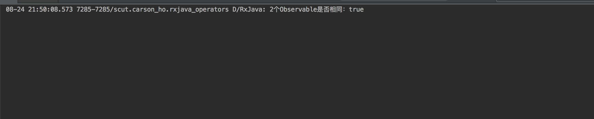

**contains( )**

作用
判断发送的数据中是否包含指定数据

> 若包含，返回 true；否则，返回 false
> 内部实现 = exists（）

``` java
Observable.just(1, 2, 3, 4, 5, 6)
        .contains(4)
        .subscribe(new Consumer<Boolean>() {
            @Override
            public void accept(Boolean aBoolean) throws Exception {
                Log.d(TAG, "result is " + aBoolean);
            }
        });
```

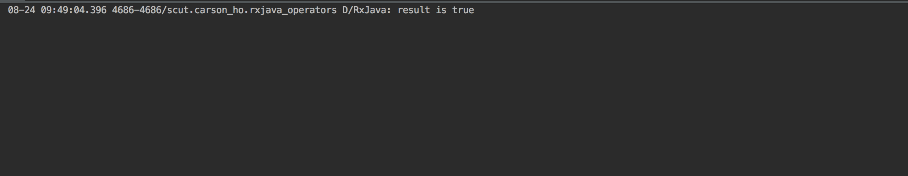

**isEmpty( )**

作用
判断发送的数据是否为空

> 若为空，返回 true；否则，返回 false

``` java
Observable.just(1, 2, 3, 4, 5, 6)
        .isEmpty() // 判断发送的数据中是否为空
        .subscribe(new Consumer<Boolean>() {
            @Override
            public void accept(Boolean aBoolean) throws Exception {
                Log.d(TAG, "result is " + aBoolean);
            }
        });
```

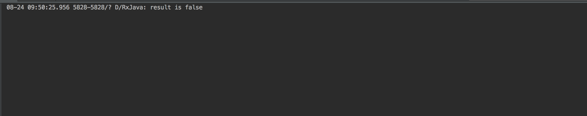

**amb( )**

作用
当需要发送多个 Observable时，只发送 先发送数据的Observable的数据，而其余 Observable则被丢弃。

``` java
// 设置2个需要发送的Observable & 放入到集合中
List<ObservableSource<Integer>> list = new ArrayList<>();
// 第1个Observable延迟1秒发射数据
list.add(Observable.just(1, 2, 3).delay(1, TimeUnit.SECONDS));
// 第2个Observable正常发送数据
list.add(Observable.just(4, 5, 6));
// 一共需要发送2个Observable的数据
// 但由于使用了amba（）,所以仅发送先发送数据的Observable
// 即第二个（因为第1个延时了）
Observable.amb(list).subscribe(new Consumer<Integer>() {
    @Override
    public void accept(Integer integer) throws Exception {
        Log.e(TAG, "接收到了事件 " + integer);
    }
});
```

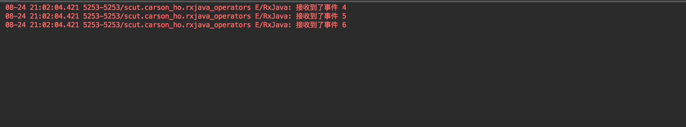

**defaultIfEmpty( )**

没啥用

### 总结

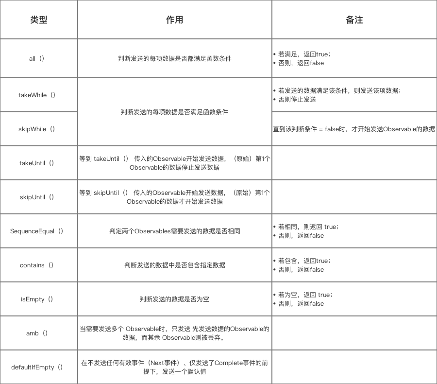